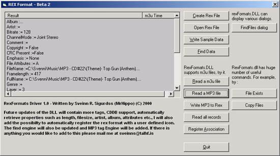



## RexFormats\.DLL \- The most powerful music engine on the web \- Beta \#3

### Description

If you are a serious music lover and a developer of music application, then ... this is it. Create simply incredible playlists with more 150 tags for each file, powerful search engine, copy files from cd to disk drive, allow multiple users to rate songs within the same file, retrieve information on many formats. Most players like Winamp, Sonique etc. have playlists. Most of them only store 2 or 3 fields. When you have more than a 100 mp3's on your computer. Finding and organizing music can be hard.

New in Beta #3

I have added some extra features to the driver, such as :

- Register. Now you can register the .rex format with your

application. You can include a description of

the file type.

- File exists. The driver can now determine if a file that you are

going to save, move, copy, already exists. F.ex. if you copy

a mp3 file from a CD to a drive.

- Copy Files. The driver can now copy an entire directory

structure or a single file to a desired location.
 
### More Info
 

             |
---                |---
**Submitted On**   |2000-11-29 20:40:20
**By**             |[N/A](https://github.com/Planet-Source-Code/PSCIndex/blob/master/ByAuthor/empty.md)
**Level**          |Beginner
**User Rating**    |5.0 (20 globes from 4 users)
**Compatibility**  |VB 6\.0
**Category**       |[Sound/MP3](https://github.com/Planet-Source-Code/PSCIndex/blob/master/ByCategory/sound-mp3__1-45.md)
**World**          |[Visual Basic](https://github.com/Planet-Source-Code/PSCIndex/blob/master/ByWorld/visual-basic.md)
**Archive File**   |[CODE\_UPLOAD1218411292000\.zip](https://github.com/Planet-Source-Code/rexformats-dll-the-most-powerful-music-engine-on-the-web-beta-3__1-13207/archive/master.zip)

### API Declarations

More than 80, so i'll skip it, but if anyone is interested, please e-mail me at sveinns@talhf.is

